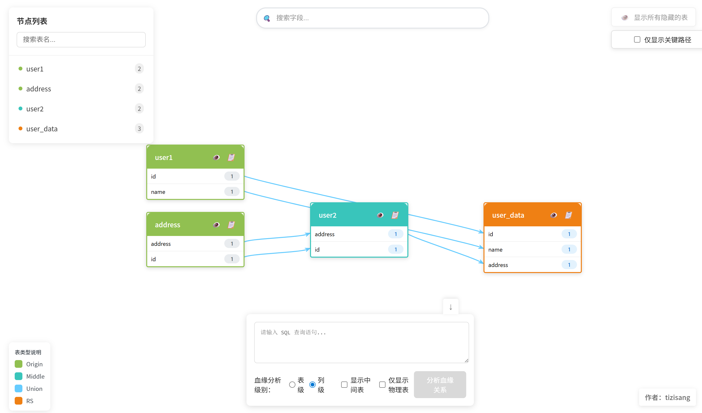

# 数据血缘关系可视化工具

这是一个基于 Vue.js 和 Python Flask 开发的数据血缘关系可视化工具。

## 项目介绍

本项目旨在帮助用户直观地展示和分析数据之间的血缘关系。通过可视化的方式，用户可以清晰地了解数据流转过程和依赖关系。

### 技术栈

#### 前端
- Vue 3
- JSPlumb：用于绘制流程图和连接线
- TypeScript
- Vite 4

#### 后端
- Python Flask
- SQLLineage：用于SQL解析和血缘关系分析
- NetworkX：用于图形数据结构处理

### 主要功能
- 数据表血缘关系可视化，包含：列级和表级
- 支持拖拽式节点布局
- 自动解析SQL语句生成血缘关系
- 支持多种数据库类型 
- 可按列名和表名搜索，并镜头自动定位
- 支持列级和表级的上下游链路高亮
- 仅显示高亮链路，支持镜头快速定位字段
- 支持按表类型（Origin、Middle、RS）进行过滤显示
- 支持按表类型分组显示，并提供组展开/折叠功能

### 启动步骤

克隆仓库：
```bash
git clone <仓库地址>
cd jsplumb-dataLineage-vue-vue3
```


## 本地开发环境搭建

如果您想在本地进行开发，需要以下环境：

### 前端环境
- Node.js
- npm

前端启动步骤：
```bash
# 安装依赖
npm install

# 启动开发服务器
npm run dev
```

### 后端环境
- Python 3.10+
- pip

后端启动步骤：
```bash
# 进入后端目录
cd api

# 安装依赖
pip install -r requirements.txt

# 启动服务器
python server.py
```

## 项目预览



## 开发说明

- 本项目使用 Vue 3 + TypeScript 开发
- 使用 JSPlumb 实现节点之间的连接和交互
- 后端基于 SQLLineage 进行二次开发，实现 SQL 解析和血缘分析
- 支持自定义节点样式和连接线样式
- 提供完整的 API 接口文档

## 浏览器访问

开发环境下访问：http://localhost:8620
