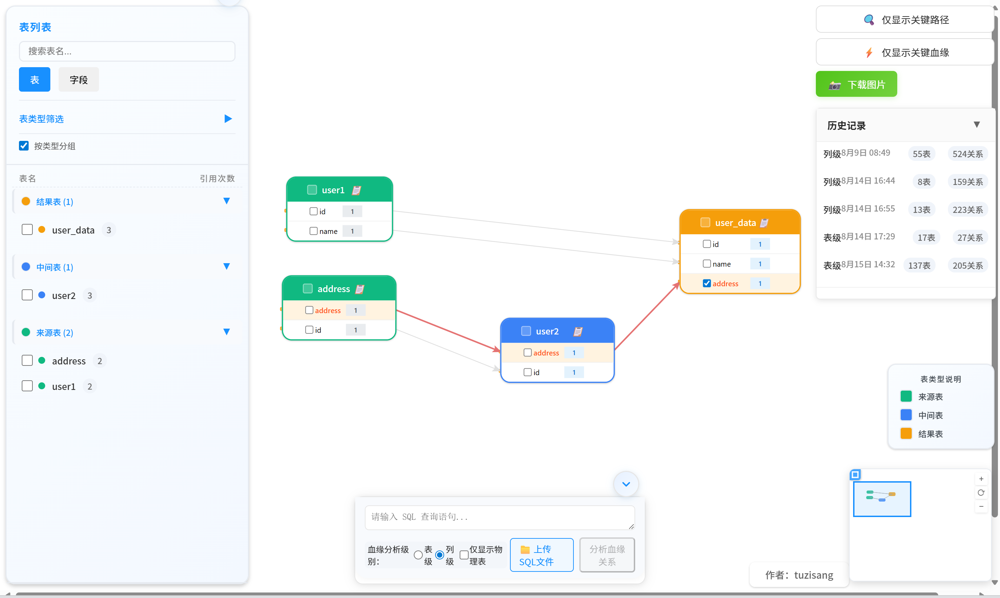

# 数据血缘关系可视化工具

这是一个基于 Vue.js 和 Python Flask 开发的数据血缘关系可视化工具。

## 项目介绍

本项目旨在帮助用户直观地展示和分析数据之间的血缘关系。通过可视化的方式，用户可以清晰地了解数据流转过程和依赖关系。

### 技术栈

#### 前端
- Vue 3
- JSPlumb：用于绘制流程图和连接线
- TypeScript
- Vite 4

#### 后端
- Python Flask
- SQLLineage：用于SQL解析和血缘关系分析
- NetworkX：用于图形数据结构处理

### 主要功能
- 数据表血缘关系可视化，包含：列级和表级
- 支持拖拽式节点布局
- 自动解析SQL语句生成血缘关系
- 支持多种数据库类型 
- 可按列名和表名搜索，并镜头自动定位
- 支持列级和表级的上下游链路高亮
- 仅显示高亮链路，支持镜头快速定位字段

### 启动步骤

克隆仓库：
```bash
git clone <仓库地址>
cd jsplumb-dataLineage-vue-vue3
```


## 本地开发环境搭建

如果您想在本地进行开发，需要以下环境：

### 前端环境
- Node.js 22.11.0
- npm

前端启动步骤：
```bash
# 安装依赖
npm install

# 启动开发服务器
npm run dev
```

### 后端环境
- Python 3.12.9
- pip

后端启动步骤：
```bash


# 安装依赖
pip install -r requirements.txt

# 进入后端目录
cd api

# 启动服务器
python server.py
```

## 项目预览



## 功能详细说明

### 数据血缘关系可视化

#### 功能概述
- 支持列级和表级血缘关系可视化
- 自动解析SQL语句生成血缘关系
- 可按列名和表名搜索，并镜头自动定位
- 支持列级和表级的上下游链路高亮
- 仅显示高亮链路，支持镜头快速定位字段

#### 核心特性
- **拖拽式节点布局**：支持手动调整节点位置
- **多种数据库支持**：适配多种数据库类型
- **智能搜索定位**：根据列名或表名快速定位
- **链路高亮显示**：突出显示上下游依赖关系

#### 使用技巧
- 使用搜索功能快速定位目标表或字段
- 通过链路高亮功能分析数据依赖关系
- 结合仅显示关键路径功能简化视图

### 小地图功能

#### 功能概述
- 提供全局视图导航，帮助用户快速定位和浏览大型血缘图
- 通过缩略图展示所有节点和连接关系的概览
- 支持多种交互方式：拖拽视口指示器、点击小地图区域、缩放控制

#### 核心特性
- **视口指示器**：实时反映主画布的可视区域，支持拖拽移动
- **点击导航**：点击小地图任意位置，主画布自动定位到对应区域
- **缩放控制**：提供放大、缩小和重置按钮，方便调整小地图视图
- **自适应缩放**：根据画布内容自动计算合适的初始缩放比例
- **本地存储**：保存用户自定义的缩放比例设置

#### 交互方式
- **视口拖拽**：在小地图上拖拽视口指示器框，主画布会同步移动
- **地图点击**：点击小地图空白区域，主画布会定位到点击位置
- **缩放操作**：使用控制按钮调整小地图的缩放级别

#### 使用技巧
- 当血缘图较大难以导航时，使用小地图快速定位目标区域
- 通过拖拽视口指示器精确控制主画布的可视区域
- 使用缩放功能在概览和细节视图之间切换
- 小地图会自动保存最后一次使用的缩放比例

#### 注意事项
- 小地图仅在有节点数据时显示
- 视口指示器的位置和大小会根据主画布的缩放和位置实时更新
- 在高分辨率屏幕上可能需要调整小地图的尺寸和缩放比例

### 表类型过滤与分组功能

#### 功能概述
- 在左侧面板添加了表类型筛选功能
- 支持按 Origin、Middle、RS 三种表类型进行筛选
- 提供全选和清空按钮，方便快速操作
- 支持将相同类型的表进行分组展示
- 分组标题带有类型对应的颜色标识

#### 核心特性
- **多选筛选**：支持同时选择多个表类型，筛选结果实时反映在列表中
- **智能分组**：自动按表类型进行分组，每个分组显示类型名称和表的数量统计
- **状态保持**：筛选状态在切换表/字段模式时保持
- **视觉反馈**：选中的类型有颜色标识，分组标题带有类型对应的颜色标识

#### 交互方式
- **筛选操作**：通过勾选表类型进行筛选，支持全选和清空按钮
- **分组切换**：通过开关控制是否按类型分组显示
- **展开/折叠**：支持分组的展开/折叠控制（▼/▶）

#### 使用技巧
- 使用类型筛选快速定位目标表
- 结合搜索功能精确查找
- 通过分组折叠减少视觉干扰
- 使用分组视图了解数据分布
- 关注引用次数了解表的重要性

#### 注意事项
- 过滤后如看不到某些连线，检查相关表是否被过滤
- 可临时取消过滤查看完整关系
- 数据量大时建议使用过滤缩小范围
- 适时折叠不相关的分组
- 合理使用搜索缩小显示范围

## 开发说明

- 本项目使用 Vue 3 + TypeScript 开发
- 使用 JSPlumb 实现节点之间的连接和交互
- 后端基于 SQLLineage 进行二次开发，实现 SQL 解析和血缘分析
- 支持自定义节点样式和连接线样式
- 提供完整的 API 接口文档

## 浏览器访问

开发环境下访问：http://localhost:8620
